= Swordlink: Glitchfall Chronicles: Backlog

== About

=== Software Tools

For Swordlink: Glitchfall Chronicles, I used the Godot Engine for the bulk of
the project, a free and open-source game engine using the GDScript language,
which is a wrapper around the C++ language with Python-like syntax.

For drawing sprites for the character and his sword, I used the GIMP, the GNU
Image Manipulation Program, a free/libre photomanipulation application, which
works well for sprite art despite not being designed specifically for it.

=== Source Code

The source code for Swordlink: Glitchfall Chronicles is available on GitHub,
at https://github.com/That1M8Head/Swordlink.

== Conceptual Stages

In Swordlink's conceptual stages, I took heavy inspiration from the stylish
action game series Devil May Cry. Initially, Swordlink was going to be a silly
non-serious 2D DMC-like named "Guy with a Sword".

I eventually decided I wanted to have something more world-built and grounded
in a proper fantasy world, set in a future where the hubris of man has led to
the world being inhabited by digital demons.

I got this idea from DOOM - a game with a story about the hubris of man leading
to the forces of Hell invading and ransacking Mars, its moons, and eventually
the Earth.

I wanted to have a character that was just a normal guy, but also a programmer,
which fits with the dystopian setting of Swordlink, while also having a
protagonist that the player might be able to relate to.

Eventually I settled on his name, Joel, initially named after no one but
retroactively named after the Vinesauce streamer. Why? Because it's funny,
really. No special reason.

== Pitch Presentation

When it came time to create a pitch presentation for university, this is where
I decided on the core idea for Swordlink - a stylish action hack-and-slash
with programming puzzle elements.

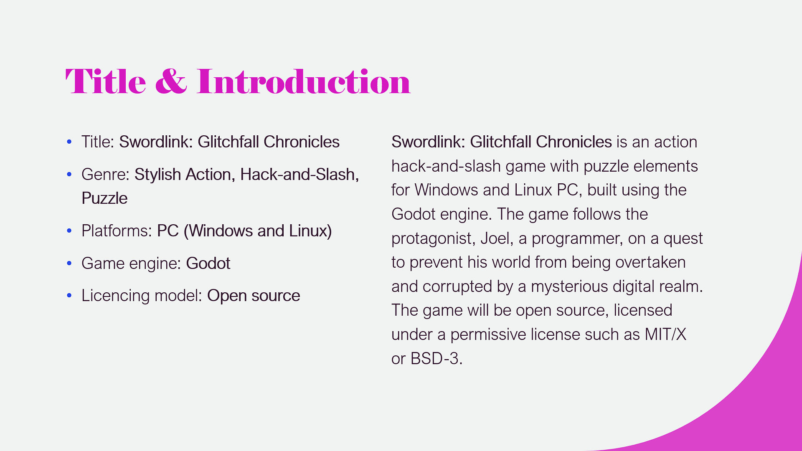

This is also where I decided on the initial idea for the game's plot: a young
man and brilliant programmer, Joel, wielding a tech sword that he built himself,
what would later be named the Circuit Saber, described as the only weapon
capable of fighting against "otherworldly threats", describing the digital
demons in the game's conceptual stages.

One key thing this presentation laid out was that the world would be constantly
flipping between the tangible reality and the digital realm, and this is what
would allow these demons in to the physical world.

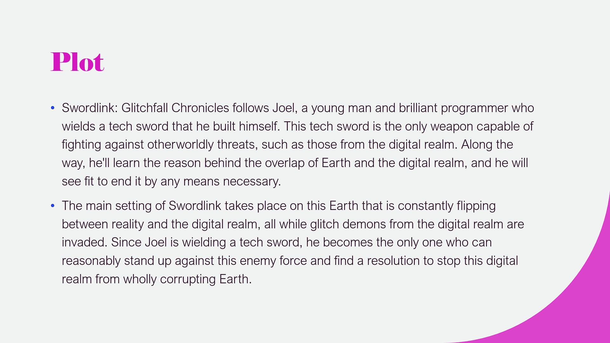

The presentation also detailed the gameplay features of the game, namely the 2D
hack-and-slash gameplay, with a style meter, combos, air combos, launching
attacks, double jumping, wall jumping and similar mechanics inspired by the
Devil May Cry games.

Interestingly, the presentation detailed the style ranks D to S, however in
the game itself, the ranks range from F to S. The game also detailed mechanics
that are not present in the game, such as double jumping, wall jumping, parrying
and taunting.

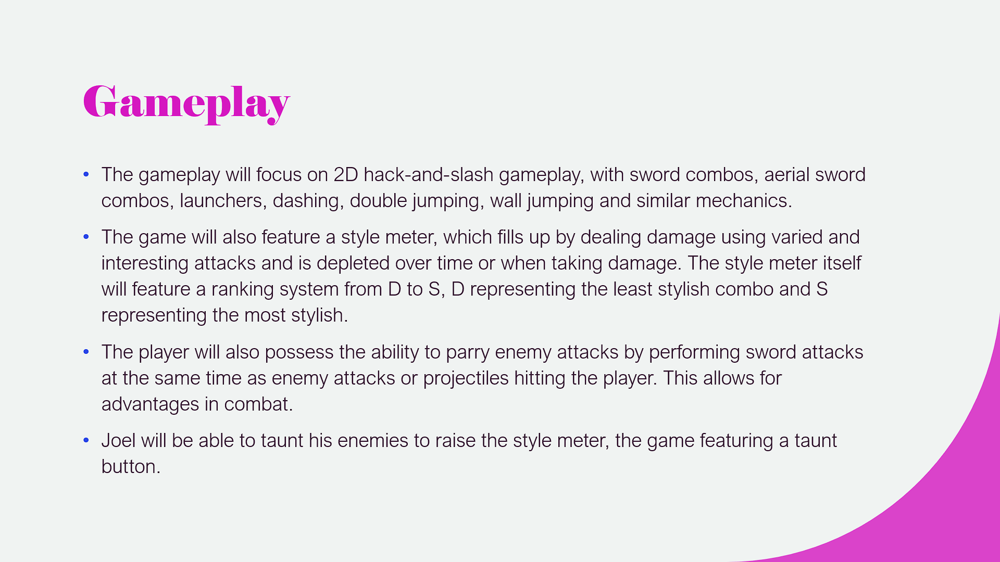

== Initial Development

=== Stage Design

At the beginning of the development process, I had to decide on the initial
design for the game's only level. I decided to take inspiration from the stylish
action FPS game ULTRAKILL - specifically, the Cyber Grind endless arena game
mode.

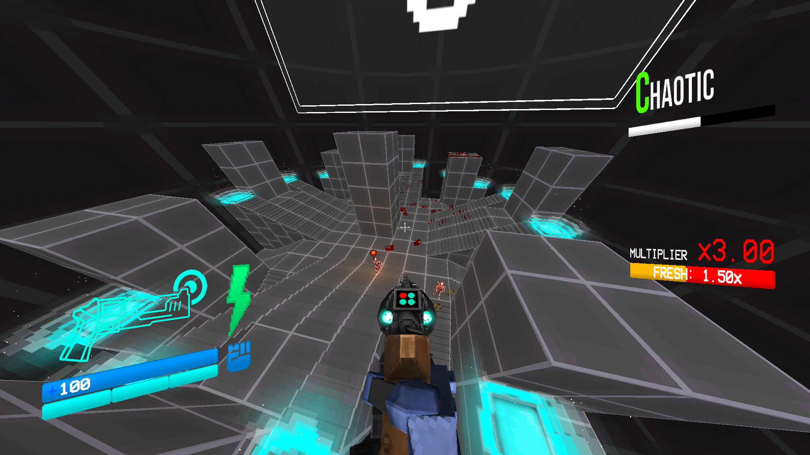

The main inspiration taken from the Cyber Grind is the grid-like aesthetic
and relatively simple level design -- perfect for a simple gameplay demo
that focuses more on combat than impressive level design.

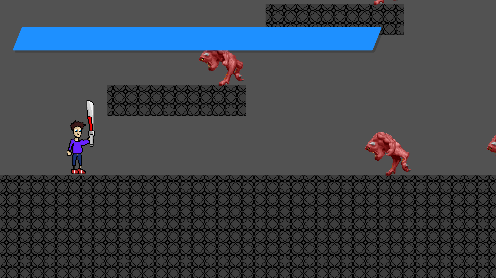

(Screenshot from commit "Initial commit",
6aa29472fcd5385ade2305edb786c44e74ababbb, which is not indicative of the initial
level design.)

While basic and unrefined, this initial level design would suit the gameplay
of Swordlink's Public University Demo, which focuses entirely on combat
elements, not so much on intricate level design.

=== Character Design

For a character sprite, I was going to spend countless hours designing and
refining pixel art for Swordlink's protagonist, Joel, but ultimately decided
it would take too much time, and settled on a much simpler image with no
animations, the Circuit Saber being separate from Joel himself, so that I
could animate it in Godot Engine using rotations rather than drawing Joel
holding the sword as one sprite, for each frame.

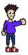  

I based Joel's design off a young man, with spiked brown hair, a purple shirt,
blue jeans and Sonic the Hedgehog-inspired shoes.

I based the design of the Circuit Saber on a sort of combination between a
broadsword and a baseball bat, with a red light on the back which was meant
to be a sword of indicator for the sword's power.

If I were given more time to work on these sprites, I would have taken
heavy inspiration from the Devil May Cry series, perhaps a sort of blend between
the characters Dante and Vergil, and I would have taken inspiration from the
indie platformer Pizza Tower for exaggerated animations and graphics.

=== Character Movement

The character movement of Joel grew incrementally, starting out with the
basic Godot Engine CharacterBody2D script, and then gradually adding more
features like jumping, evading, attacking, aerial momentum, and the Mode-Shift
mechanic.

A key part of making the movement in Swordlink work was making sure Joel's
momentum was preserved while also allowing him to control his direction both
on the ground and in the air, allowing for high-speed movement with max control.

In addition to this, the Mode-Shift mechanic, to make it less challenging to
land attacks where you want them to land, will slow Joel down and inhibit his
momentum entirely.

=== HUD Design

The first thing I did when designing the HUD was create a simple health bar and
a rank with an associated description. This rank would eventually become the
style meter.

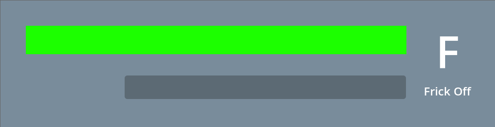

There was no proper implementation yet - the health bar had no functions to
update concurrently with Joel's actual health (since it didn't exist yet) and
there was no scripting at all for the style meter, so it just remained at F.

The style meter would be highly inspired by the system in Devil May Cry 3,
where attacking enemies would fill up the meter, waiting or getting hit would
make the meter drop, if the meter filled it would raise your rank, and if the
meter emptied it would lower your rank.

The HUD went through several iterations before settling on a final design -
the health bar used tweening to animate the health bar, and the style meter
used a simple growing animation when gaining a new rank.

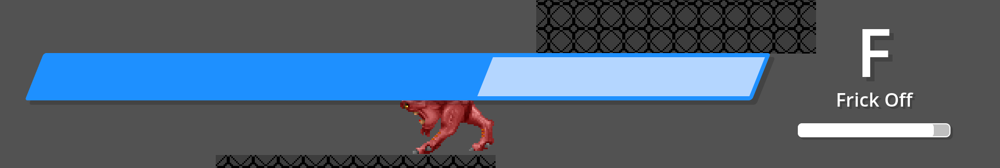

The health bar was given a slanted blue appearance with a light blue background,
and the style meter was given a more rounded appearance with an outline, being
placed underneath the style rank.

=== Menu Design

The menu was the part of Swordlink I probably spent the least amount of time
on. While I still worked on it a lot, it wasn't nearly as much as how much
time I put into working on the other parts of the game.

I decided not to reinvent the wheel, opting for a simple text-based menu
using the Godot Engine's Label nodes for menu items.

image:menu.png[Menu]

This is where I came up with the idea of making this edition of Swordlink the
"Public University Demo", since it was the first public demo created entirely
for this university project.

I decided not to make this too extravagant for the sake of simplicity, so I
could actually put my limited time towards the parts of the game that actually
mattered.

The "NEW GAME" option originally started the game straight away without a
further prompt, but I decided later to add a difficulty menu that the user could
choose to back out of if they wanted to.

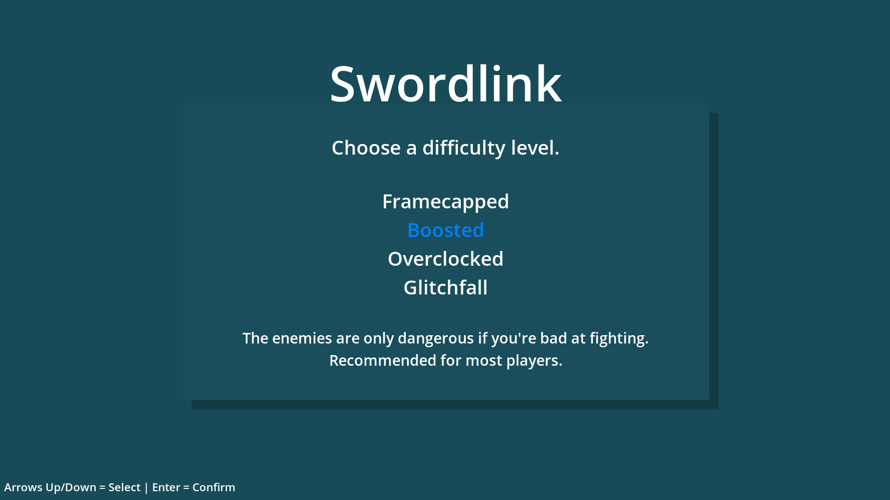

The "INFO & CONTROLS" option was the main menu option that originally brought
up the help screen, detailing what Swordlink was and what controls were
available. This was later extended to a full help menu.

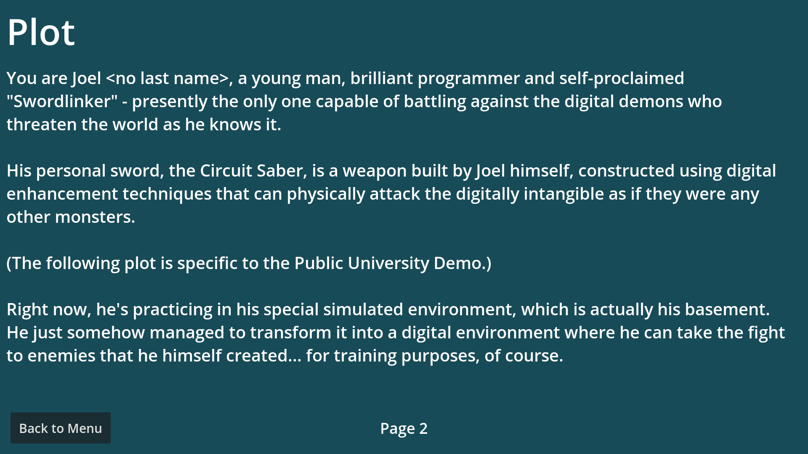

The "QUIT TO <OS name>" option initially quit the game immediately, but I
quickly decided I wanted to have a DOOM-style quit prompt, with randomised
funny messages to almost try and dissuade the player from quitting, even
opting for the old DOS game-style Y to quit and N to go back.

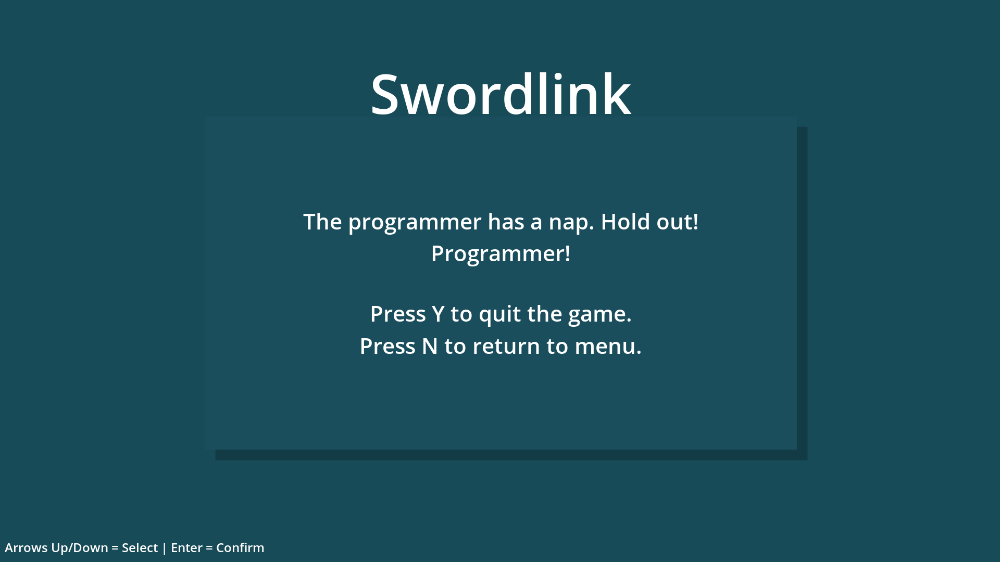

=== Menu Scripting

For scripting, I resorted to using a selection system with Godot Engine's
`modulate` property to change the colour of the menu items when selected.

The selected menu item, when the `MenuConfirm` action was pressed, would
trigger the selected menu item's functionality, defined in a `match` statement.

[gdscript]
----
func select_option(index):
	$MenuOptions.get_children()[selected_option_index].modulate = Color(1, 1, 1)
	selected_option_index = index
	$MenuOptions.get_children()[selected_option_index].modulate = Color(0, .5, 1)  # Highlight selected option

func select_next_option():
	$MenuMove.play()
	select_option((selected_option_index + 1) % $MenuOptions.get_children().size())

func select_previous_option():
	$MenuMove.play()
	select_option((selected_option_index - 1 + $MenuOptions.get_children().size()) % $MenuOptions.get_children().size())

func execute_selected_option():
	# Execute the action corresponding to the selected option
	match selected_option_index:
		0:
			start_new_game()
		1:
			open_options_menu()
		2:
			exit_game()
----

=== Enemy Design

Originally, I was going to design the enemies myself, but at the last minute
I decided to just take an enemy from DOOM - the Pinky, known in-game as the
Demon.

In Swordlink, the Pinky behaves much like it does in DOOM, running up to the
player and rapidly performing a bite attack.

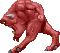

I implemented a feature where, upon taking damage, a hit number will appear
above an enemy, indicating how much damage was taken, in addition to a small
health bar. Both of these elements would gradually fade away after a short
time, until the enemy gets hit again.

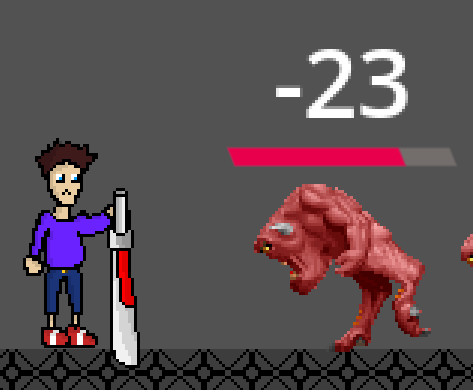

I didn't have to do much to get the Pinky to work - I simply took the basic
CharacterBody2D script and adapted it to make an enemy, setting the layer and
layer masks and creating instances of it in the main `game.tscn` scene.

=== Health System

For a health system, I simply created a `health` variable inside Joel's script
and included functionality to constantly update the health bar inside of the
`_process` function.

[gdscript]
----
var health: int

...

func _ready():
	...
	health = 100
    ...

func _process(delta):
	var health_bar = get_node("/root/Game/CanvasLayer/HUD/HealthBar")
	var health_tween = get_node("/root/Game/CanvasLayer/HUD/Tween").create_tween()
	health_tween.tween_property(health_bar, "value", health, 0.1)
    ...
----

The `health` variable itself is set in both the `deal_damage` and `damage_self`
functions, the former increasing the player's health if the attack exceeds
the enemy's health value, and the latter decreasing the player's health
regardless of how much damage was dealt.

[gdscript]
----
...
func deal_damage(body, damage: int, knockback: Vector2):
	$HitSound.play()
	var difficulty_handler = get_node("/root/DifficultyHandling")
	if damage > body.health and difficulty_handler.level < 3:
		var health_reward = damage / 6
		health += health_reward * (style_rank + 1)
	style_duration += damage * 48 if not body.is_on_floor() else damage * 19
	var flip = -1 if $JoelSprite.flip_h else 1
	body.take_damage(damage, Vector2(knockback.x * flip, knockback.y))

func damage_self(amount: int):
	if dashing:
		return
	health -= amount
	var style_rank_meter = get_node("/root/Game/CanvasLayer/HUD/Style/Meter")
	style_duration -= style_rank_meter.max_value / 3
...
----

=== Style System

For the style system, the process was largely the same - creating variables,
`style_rank` and `style_duration` and updating them in the `_process` function
as well as the custom `deal_damage` function, which is called whenever
an enemy enters the player's hitbox.

[gdscript]
----
func deal_damage(body, damage: int, knockback: Vector2):
    ...
	style_duration += damage * 48 if not body.is_on_floor() else damage * 19
    ...
----

=== Failure Screen

After a system was implemented to have the player lose health upon taking
damage, I decided a simple "Game Over" screen simply wasn't enough. I wanted
to make the player laugh - or at least amused - when they failed at the game.

With this in mind, I took inspiration from a DOOM II mod named Reelism 2, which
includes funny death messages and descriptions for the player's status.

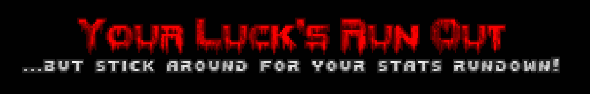

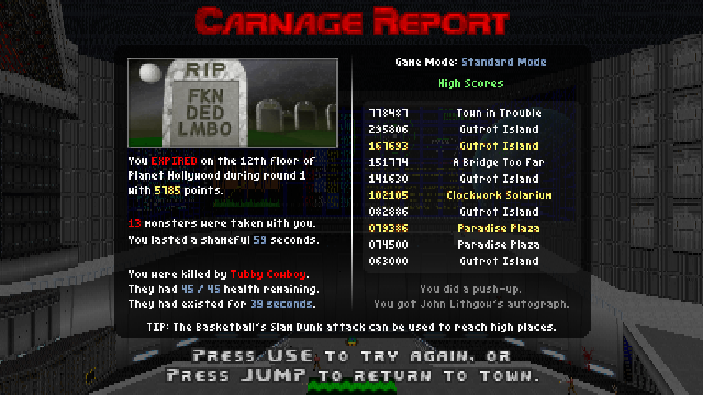

So, in Swordlink, I did a similar thing - a randomised death message and
a randomised funny quote, either to make the player laugh or mock them
for being bad, some messages and quotes being references to other games.

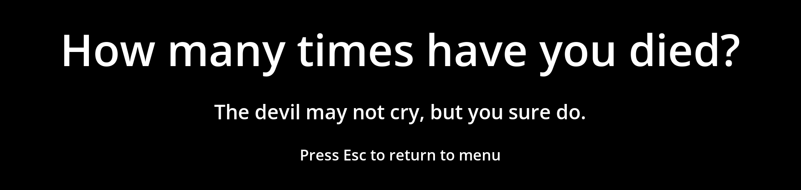

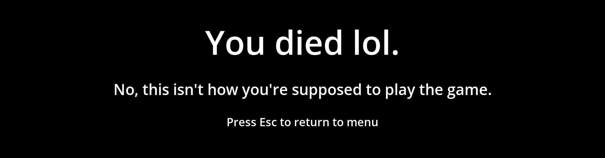

=== Easter Eggs

==== Guru Meditation

The biggest Easter egg in Swordlink is probably the Amiga-style Guru Meditation
error message.

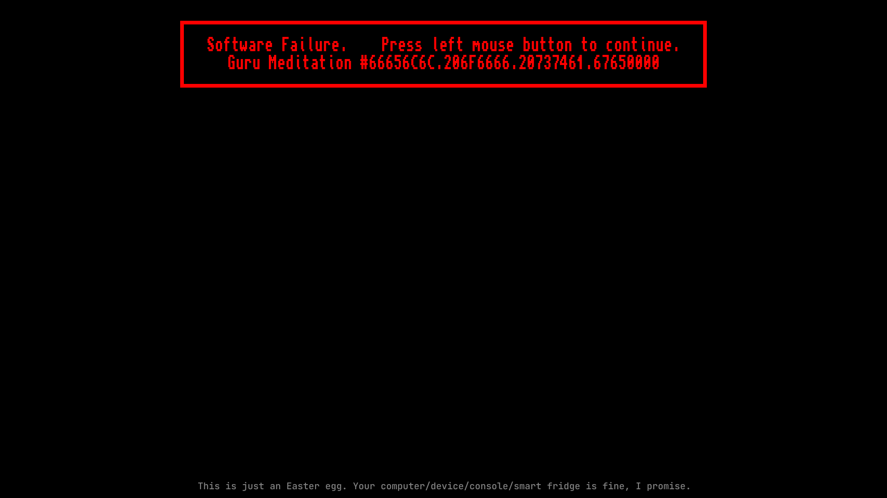

This error screen is a direct reference to the Guru Meditation error from the
AmigaOS operating system for the Commodore Amiga line of home computers,
specifically versions of AmigaOS between 1.0 and 3.x, since 4.0 onwards,
this error was replaced with the more user-friendly and less catastrophic
"Grim Reaper".

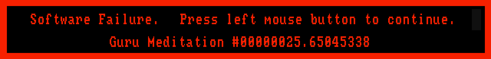

And there are layers to this Easter egg - left-clicking, as the error instructs
you to do, will return you to the main menu without another word, but
_right_-clicking, however, will bring up the second Easter egg, known as
ROMWack.

==== ROMWack

ROMWack directly takes its name from the AmigaOS debugger, also called ROMWack,
however, in Swordlink, it's a full command-line environment.

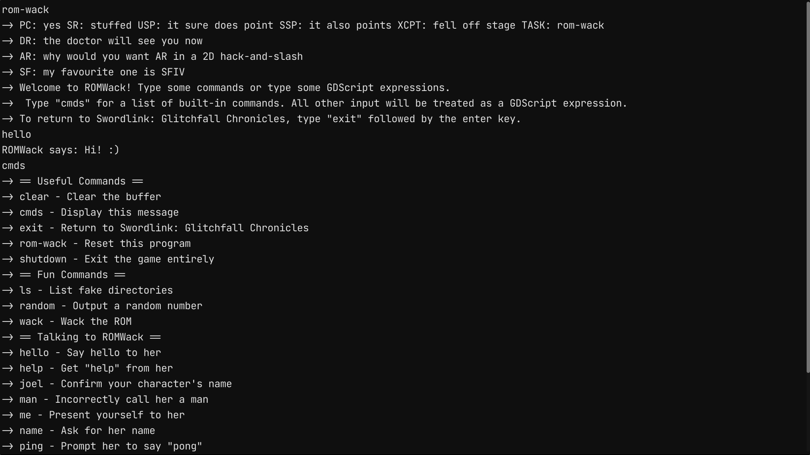

ROMWack is a sort of developer console within the context of Swordlink - as
well as that, she's also a character in her own right. You can enter Unix-style
commands, and get either the console or ROMWack to say something.

For example, entering `hello` will prompt ROMWack to say `Hi! :)`

I put a lot of effort into this Easter egg, creating a whole command-line
environment that pays homage to one of my most favourite error messages in
computing history.

=== Difficulty Selection

After a lot of refinement and playtesting, I decided that the difficulty was
too low, so I decided to speed up the enemies' attack rate. This proved to
be much more challenging, but when I built the game for Android to test on
my phone, I noticed it was a bit too hard. So instead of going back on this,
I decided to fully implement a difficulty selection system.

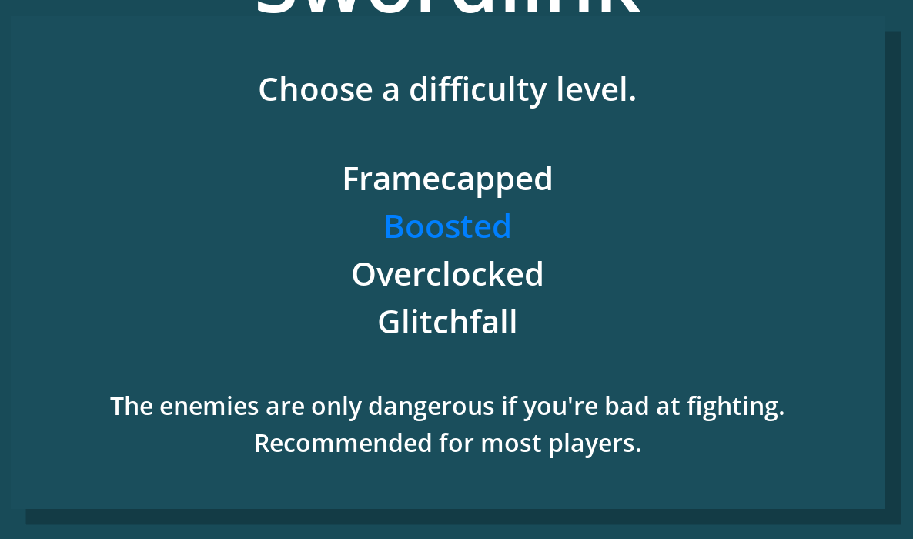

For these difficulties, I took minor inspiration from the Halo series and Devil
May Cry 5 when it came to the descriptions.

*Framecapped* difficulty was the easy difficulty, and a direct port of the
original enemy behaviour, mainly for people playing on touch devices.

The new *Boosted*, *Overclocked* and *Glitchfall* difficulties were much harder
in comparison - Glitchfall especially being the worst, since not only do enemies
attack just as fast and on Overclocked, but Joel's health will no longer
regenerate upon defeating enemies.

To handle the difficulty selection, I reused the same code I used for the
main menu, since it worked perfectly and was fairly easy to implement.

To make every script aware of the difficulty level, I attached a script,
`DifficultyHandling.gd`, as an autoload, which is in a global scope and
accessible from any script.

[gdscript]
----
extends Node

enum DIFFICULTY {
	FRAMECAPPED,
	BOOSTED,
	OVERCLOCKED,
	GLITCHFALL
}

var level := DIFFICULTY.BOOSTED
----

And, for example, if I wanted to update the enemies' attack speed, I could,
first of all, create an instance of the `DifficultyHandling` script,

[gdscript]
----
@onready var difficulty_handler = get_node("/root/DifficultyHandling")
----

and then update the enemies' attack speed accordingly.

[gdscript]
----
var speed = 100.0
...
var total_time = 0.3
var current_time = 0.0

func _ready():
	match difficulty_handler.level:
		difficulty_handler.DIFFICULTY.FRAMECAPPED:
			speed = 100.0
			total_time = 0.5
		difficulty_handler.DIFFICULTY.BOOSTED:
			speed = 200.0
			total_time = 0.3
		difficulty_handler.DIFFICULTY.OVERCLOCKED:
			speed = 400.0
			total_time = 0.2
		difficulty_handler.DIFFICULTY.GLITCHFALL:
			speed = 400.0
			total_time = 0.2
    ...
----

=== Help Pages

After deciding I was unhappy with the original help screen being hard to read,
due to how much information I had packed into one single space, I decided to
implement a proper help page system the player could scroll through.

I decided to make this simple and text-based, just like the main menu, so the
player could scroll through the pages with the directional inputs, *Up* or
*Left* sending the player back a page, and *Down* or *Right* sending them
forward.

In these pages was a more robust explanation of how the controls work, and the
special techniques available to Joel.

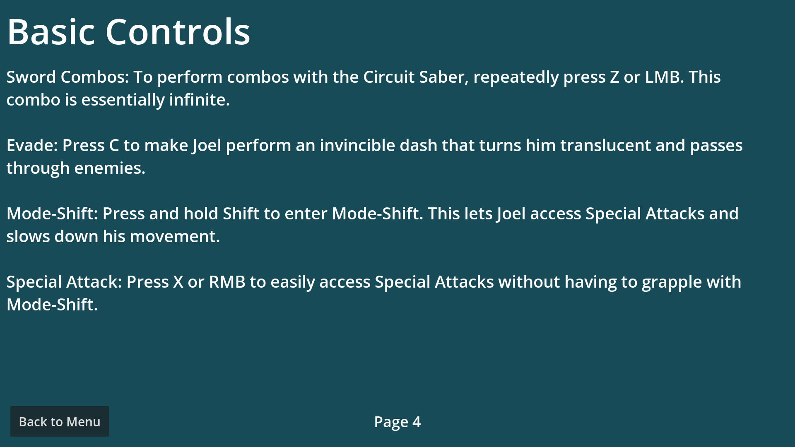

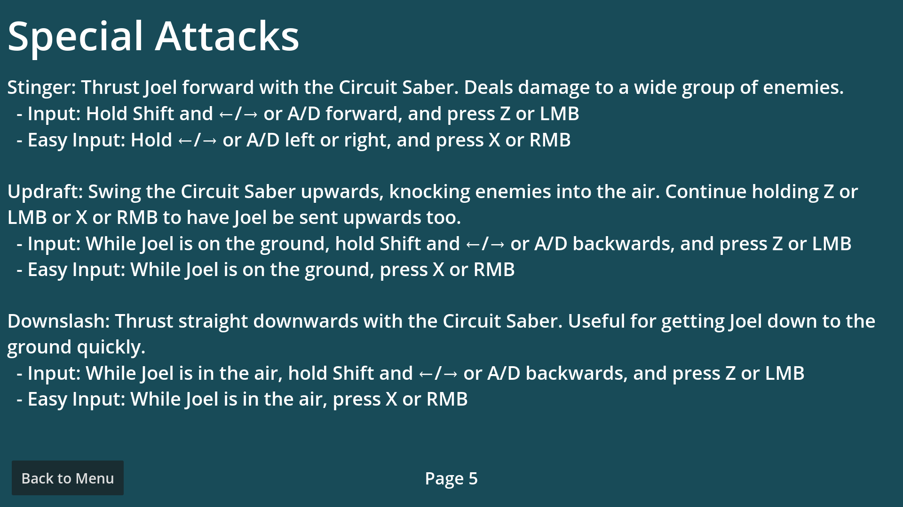

This in itself was much nicer on the eyes and easier to read, which was a
much-needed improvement over the original help screen which tried to cram as
much detail as possible in a standard 1920x1080 screen.

=== Victory Screen

I procrastinated on this feature for the longest time - the victory screen,
triggered upon defeating all the enemies, wasn't implemented until much later.

I largely followed the same process as I did for the death screen, only with
a bright blue background instead of black, and with more congratulatory remarks.

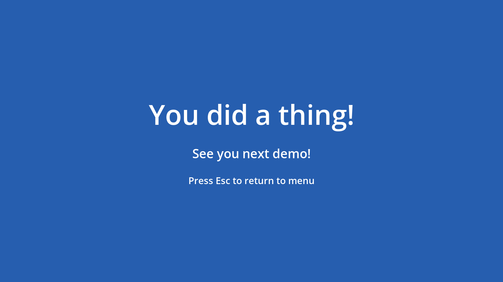

=== Pause Menu

Another thing I didn't really do until much later was a pause menu. Before,
pressing the start button (Menu on an Xbox controller) would just return the
player to the main menu, completely forgetting about the previous state of the
game.

I eventually decided upon implementing a simple pause menu - rather than waste
time trying to implement a proper menu based on the main menu code, I decided
to use a simple message, handling the `MenuConfirm` action to go back to
the menu, and the `MenuBack` action to return to the game.

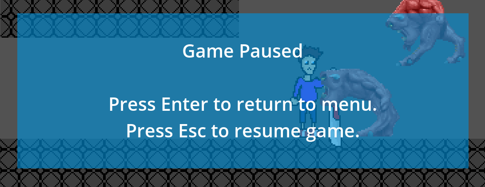

== Mechanics

=== Controls

The control scheme is based off of the control scheme of the Devil May Cry
series, starting with DMC2.

On an Xbox controller, it uses the left stick for movement, the Y button for
attacks, the A button for jumping, the B button for evasions and the RB or RT
button to enable Mode-Shift, as well as the X button used for easy input of
special attacks, which is not a DMC thing, but the button wasn't used for
anything else, considering Joel lacks any long-range options.

The special attack button was created out of a need for a simpler control
scheme on touchscreen devices, where trying to use Mode-Shift using only a
frontal panel of non-tactile controls would be too much of a hassle.

=== Special Attacks

Joel is able to use three special attacks - Stinger, Updraft and Downslash.

Stinger is directly based off the Stinger attack that the Devil May Cry series
implements, where the protagonist holds his sword in a thrusting motion and
dashes forward.

Updraft is based off of the High Time attack from the Devil May Cry series,
which involves the protagonist swinging his sword upwards, knocking enemies
into the air. Like High Time, if you hold down the input for Updraft, Joel will
be sent up in the air along with his target.

Downslash is loosely based off the Helm Breaker attack from the Devil May Cry
series, which involves the protagonist swinging his sword downwards while
sending himself straight downwards, dealing high damage to enemies below.

=== Mode-Shift

The Mode-Shift mechanic is the answer to the lock-on feature used in the Devil
May Cry games, only instead of locking on to anything, Joel will only lock his
direction, allowing him to access Stinger, Updraft and Downslash through
directional inputs using the Attack button.

Mode-Shift will additionally slow Joel's movement speed down and completely
stop all momentum, which is necessary for the special attacks' directional
inputs.

== Deployment

When Swordlink's Public University Demo is finished, I will be deploying it
through GitHub Releases. itch.io is another consideration, but I want to
delay that until I can create properly original sprites and animations.

When I finish Swordlink proper, with a whole set of levels and properly
refined combat mechanics, I will consider deploying it through Steam, for
money.

== Differences from the Pitch Presentation

I'll be going slide by slide, comparing each element to how it matches the
current status of the game.

=== Slide 2: Title & Introduction

* *Title:* Still the same title of "Swordlink: Glitchfall Chronicles".
* *Genre:* The stylish action hack-and-slash elements are in the demo,
but the puzzle elements are not.
* *Platforms:* Remained available for Windows and Linux, but also extended to
Android.
* *Game engine:* Remained the same, Godot Engine.
* *Licensing model:* Remained open source.

=== Slide 3: Plot

The Public University Demo's plot is loosely based off the plot in the pitch
presentation, but it takes place non-canonically before the events described
in the presentation.

=== Slide 4: Gameplay

The 2D hack-and-slash gameplay is still intact, with sword combos, aerial sword
combos, launching and dashing, but the double jump and wall jump were not
implemented.

The style meter got changed, ranging from F to S rather than D to S, and the
system to reward varied attacks was not implemented in the demo.

The parry mechanic detailed in this slide was not added, mainly due to the
simpler combat system in the demo.

=== Slide 5: Game Engine

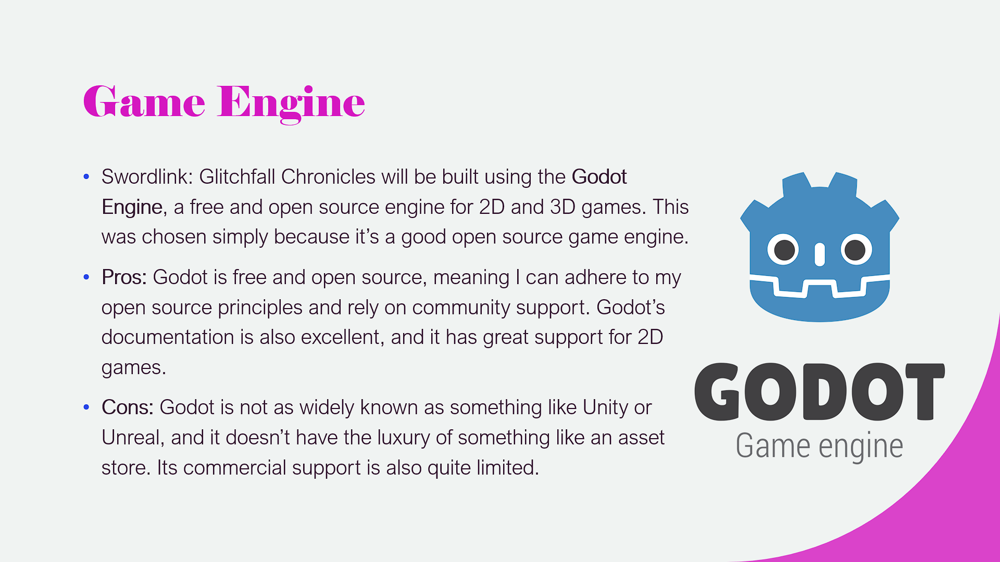

I stood by my original decision to use the Godot Engine, and unlike what I
may have had concerns with, not having access to an asset store was not
a concern.

=== Slide 6: Game Mechanic - Glitched State

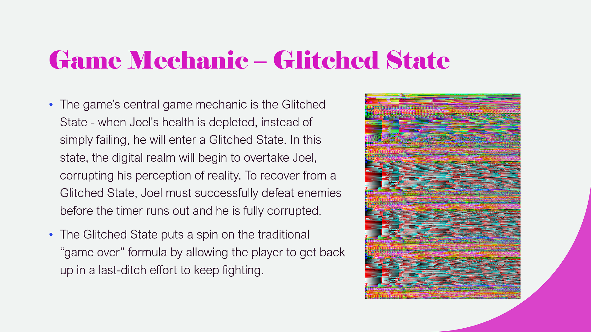

This game mechanic was not implemented at all in the demo due to a lack of time
and development resources - upon losing all health, the player will just be
taken to a minimalist game over screen.

=== Slide 7: Minigame - Programming

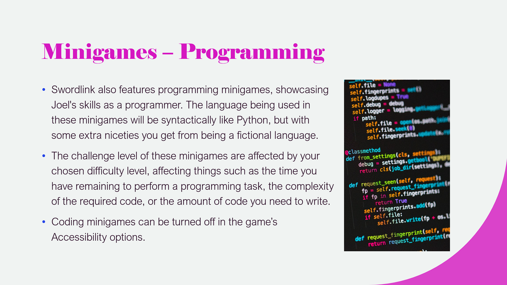

As detailed above several times, these minigames were not implemented, as the
Public University Demo's focus is entirely on combat. Moreover, programming
minigames are intrinsically tied to the plot, and the demo lacks one.

=== Slide 8: Graphics & Art Style

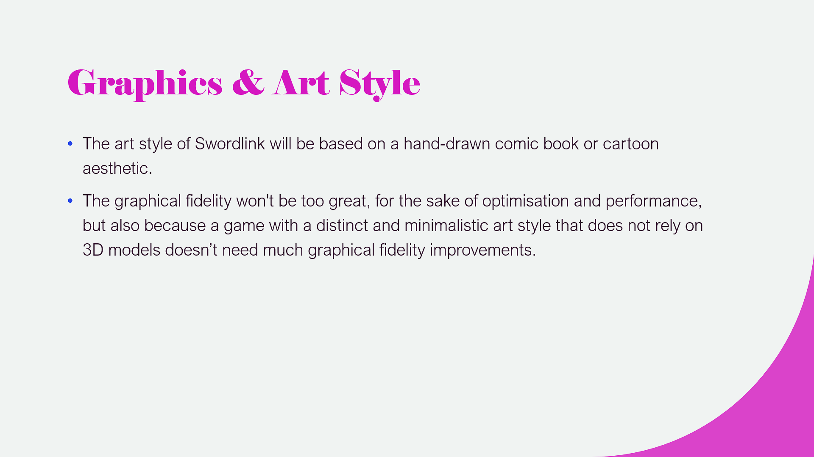

Rather than a comic book style, I decided to forgo a consistent style altogether
for the sake of the Public University Demo, however I intend to use a
comic book-inspired pixel art style in the future.

=== Slide 9: Marketing & Monetisation

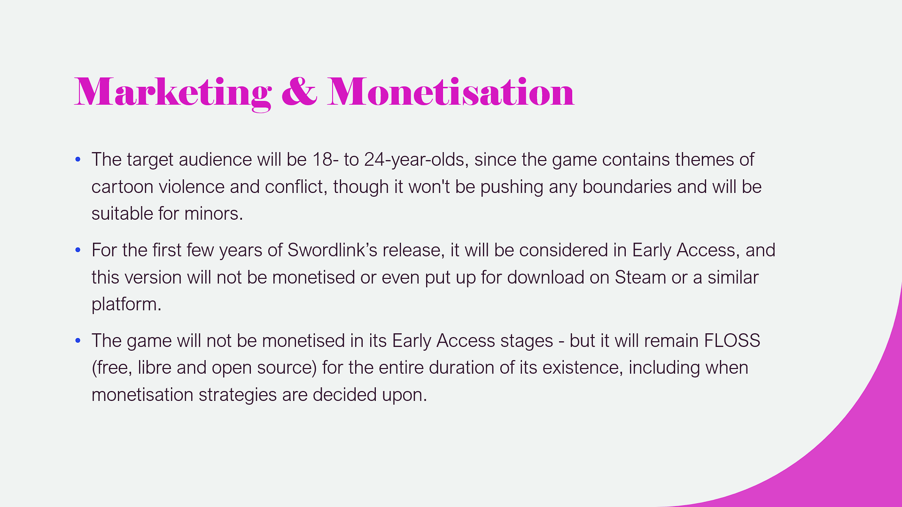

The target audience remains in the 18- to 25-year-old demographic, since the
game focuses on rapid and dynamic combat against demons, however, as the slide
describes, the game will be fine for minors between 13 and 17 years of age to
play.

== Requirements

=== User

* Develop a compelling narrative
  ** The Public University Demo contains no story, so this requirement
  was not met out of consideration for time.
* Design dynamic gameplay
  ** The combat is indeed fast-paced and dynamic, and while there's room for
  improvement, this requirement was met to a satisfactory extent.
* Integrate programming minigames
  ** The Public University Demo focuses entirely on combat, so this requirement
  was not met, similarly to the narrative.
* Create good-looking visuals and audio
  ** Currently, the visuals are rather rough or taken from other games, and the
  audio elements were entirely taken from existing games, so this requirement
  was not met.
* Optimise performance across platforms
  ** The game performs decently on both Windows and Android platforms, so this
  requirement was met to an extent.
* Implement educational value
  ** Since programming minigames were not implemented, which is a prerequisite
  for this requirement, it was not met.
* Test and refine game mechanics
  ** This requirement was met - Swordlink has gone through a high level of
  testing.

=== System

* Use Godot Engine
  ** The Godot Engine was used for the development of the game, so this
  requirement was met.
* Create sprites and animations
  ** This requirement is not met, because there are non-original sprites
  in the game, and the animations are placeholders.
* Create music and sound effects
  ** The audio is used from existing games, so this requirement was not
  met.

== Test Plan

|==============================
| ID | Test | Expected | Windows | Android
| 1  | Menus | Menu navigation, selection, difficulty selection and exit prompt work. | ✅ | ✅
| 2  | Movement | The player can move left and right. | ✅ | ✅
| 3  | Attack | The player can attack in a combo, and the sword animation plays properly for each direction. | ✅ | ✅
| 4  | Jump | The jump works and the player can get up onto higher platforms. | ✅ | ✅
| 5  | Enemy | Enemies move, turn and attack the player. | ✅ | ✅
| 6  | Health | Health bar updates and tweens. | ✅ | ✅
| 7  | Style | The style meter increases as the player attacks and decreases as the player takes damage or waits. | ✅ | ✅
| 8  | Controller input | The game supports PlayStation and Xbox controllers. | ✅ | ✅, but only PS5 controller tested
| 8  | Touch controls | The touch controls appear on touch-enabled devices and work throughout the game. | ✳️, no touchscreen on Windows | ✅
| 9  | Game over | The game over screen shows when the player has no health left. | ✅ | ✅
| 10 | Victory | The victory screen shows when all enemies are defeated. | ✅ | ✅
| 11 | Pause | The pause menu works. | ✅ | ✅
| 12 | Easter egg | The Guru Meditation and ROMWack Easter eggs work. | ✅ | ✅
|==============================
