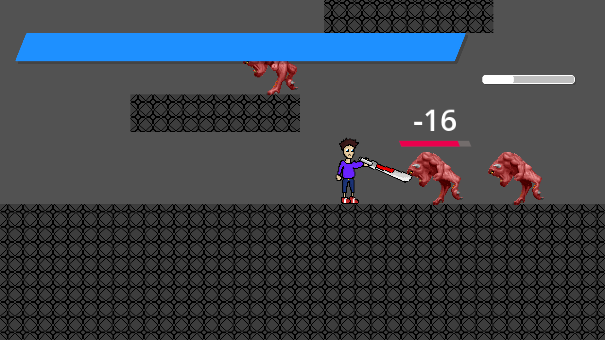
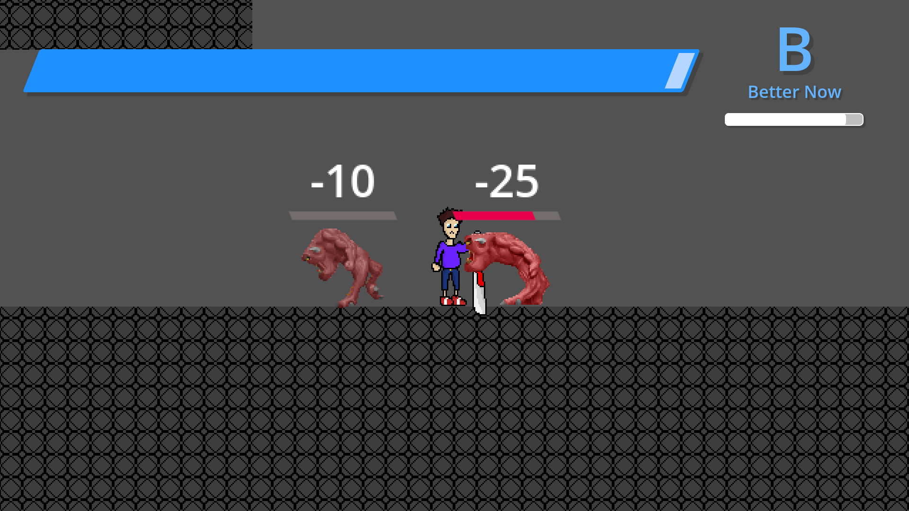
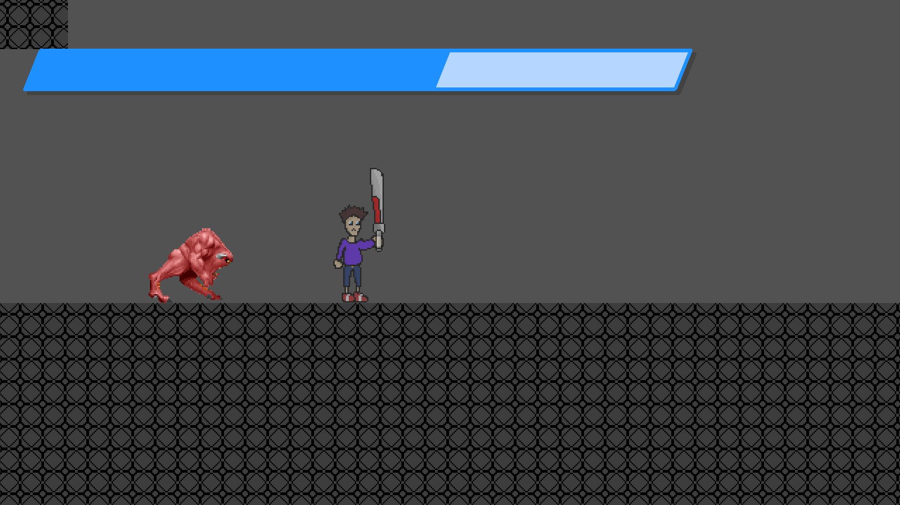
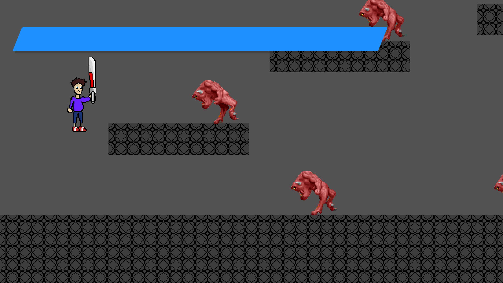
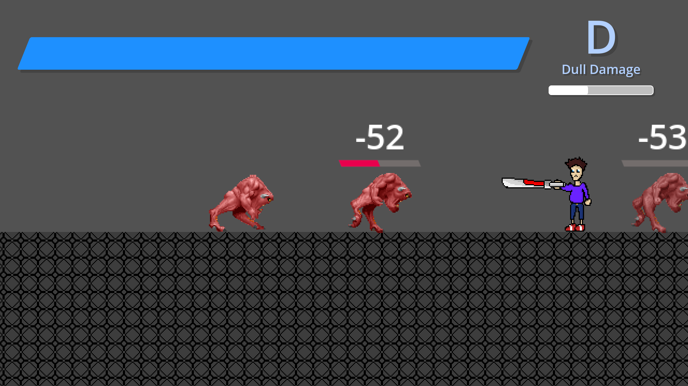
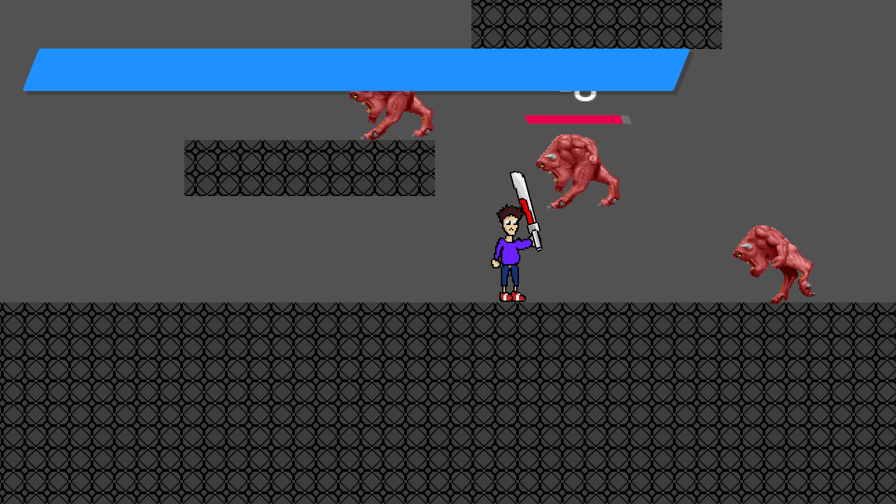
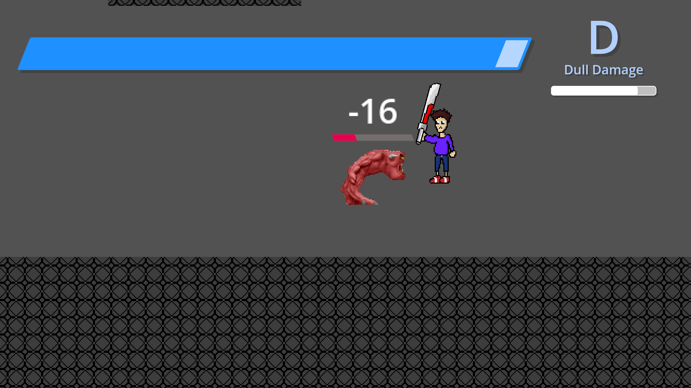
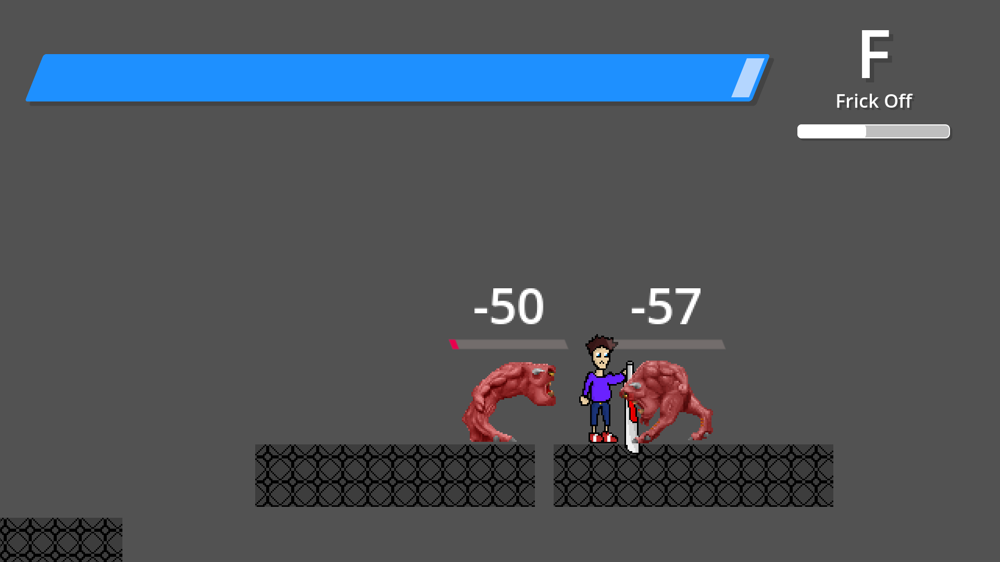

Swordlink: Glitchfall Chronicles Documentation
==============================================

.. warning::
   This documentation and associated documentation files pertain to the Public
   University Demo of Swordlink: Glitchfall Chronicles.  These are subject to
   change at any time without notice.

Overview
------------

Swordlink: Glitchfall Chronicles is a 2D stylish action and puzzle game starring
the brilliant programmer, Joel, on a mission to protect his world from the
digital demons that dare threaten it, with his trusty sword, the Circuit Saber.

Swordlink: Glitchfall Chronicles is built in the Godot Engine, free software
under the GNU General Public License, either version 3 of the license, or, at
your option, any later version.

Public University Demo
----------------------

The Public University Demo of Swordlink: Glitchfall Chronicles focuses mainly
on the gameplay mechanics of Swordlink without so much worrying about graphics
or a story or anything too cohesive that you might see in the full version.

As such, it contains the following copyrighted/trademarked material:

- Sword sound effects from Devil May Cry 3
- Evade sound effect from Sonic the Hedgehog 3
- Menu sound effects from Sonic the Hedgehog (2006)
- Main menu music from Yakuza/Ryu ga Gotoku
- Help menu music from Sonic Adventure 2
- Battle music from Yakuza Kiwami/Ryu ga Gotoku Kiwami
- Enemy sprites from DOOM

These are **placeholders**, and will be replaced with original assets in the
full edition of Swordlink: Glitchfall Chronicles.

The Public University Demo additionally does not include any puzzles, focusing
solely on the combat.

As the Public University Demo includes copyrighted and trademarked material, it
is not legally available to be sold for money, so it's entirely free for
non-commercial use.

Main Menu
---------

Upon starting the game, the main menu is shown.

.. image:: menu-screenshot.png

From here, you can start a new game, read the help menu, or quit the game and
return to your desktop or home menu.

Use **Up** and **Down** to select an option, and press **Enter** (keyboard),
**A** (controller) or **OK** (touchscreen) to activate the selected option.

Help Menu
---------

Choose "INFO & CONTROLS" and you'll be taken to the help menu.

.. image:: help-screenshot.png

The help menu is split into three pages - **About**, **Basic Controls** and
**Special Attacks**.

Use **Up** and **Down** to flip through the pages.

When you're done reading through the help pages, press **Esc** (keyboard),
**B** (controller) or **BACK** (touchscreen) to return back to the main menu.

Gameplay
--------

Choose "NEW GAME" to start a new game, jumping straight into the action.

Basics
^^^^^^

.. image:: gameplay-screenshot-1.png

That young man holding the sword is Joel, your player character. The large
blue bar is your health bar. Let that deplete and it's game over.

Use the **Left** and **Right** arrow keys/buttons/stick directions to make Joel
move around the level.

Attacking
^^^^^^^^^

When you're up close and personal to the demon heading straight for Joel,
press the **Z** key, **Left** mouse button, **Y** controller button or
the touch button that looks like a sword to attack. Repeatedly press this button
to perform combos. This key will henceforth be called **Attack**.

You'll notice a few things will happen on-screen next.

Style Meter
^^^^^^^^^^^

You'll see the amount of damage you dealt to the demon as well as how much
health it has left above its head, but you'll also see a strange white gauge
to the right of your health bar.

That bar is your style meter, and it'll fill up the more hits you manage to dish
out. Getting it high enough will let you net higher and higher ranks, from F to
S. But be careful, because waiting around or getting hit will make it drop.

In addition to raising your style meter, defeating enemies will refill your
health, so be mindful of how much damage you take and how much you dish out,
and the amount of health you regain is dependent on your style rank.

Evasion
^^^^^^^

While you're holding a movement direction, press the **Shift** key, **B**
controller button or the touch button that looks like two arrows overlayed over
each other to perform an evasion.

Evading will briefly turn Joel translucent, granting him a quick dash which
lets him pass right through enemies - and he can still attack during this
brief invincibility.

Joel can even evade when he's in the middle of being trapped by a bunch of
enemies surrounding him.

Jumping & Aerial Combat
^^^^^^^^^^^^^^^^^^^^^^^

Fighting on the ground is all well and good, but Joel can also take advantage
of his technologically-enhanced jumping shoes to leap high into the air.

Press the **Space** key, **A** controller button or the touch button with an
upward-pointing arrow to make Joel jump.

And while Joel is in the air, he can still move around and attack just the same.

Influence your mid-air movement with the **Left** and **Right** arrow
keys/buttons/stick directions and press the **Z** key, **Left** mouse button,
**Y** controller button or the sword touch button to perform attacks.

Performing aerial attacks will cause your style meter to fill up twice as fast,
so prioritise attacking your enemies in the air. But how exactly do you get them
*in* the air...?

Special Attacks
^^^^^^^^^^^^^^^

There are *two* ways to perform special attacks: through the Mode-Shift mechanic
or through Easy Input.

To use Mode-Shift, press and hold the **Ctrl** key, **Middle** mouse button,
**RB** or **RT** controller buttons or the touch button with an **M** on it.
Mode-Shift will lock Joel's orientation and slow down his movement.

To use Easy Input, press the **X** key, the **Right** mouse button, the **X**
controller button or the touch button that looks like a sword on top of some
arrows pointing right. This key will henceforth be called **Special**.

Stinger
#######

Stinger is a high-damaging, high-knockback thrusting move which throws Joel's
whole weight behind a powerful forward dash with the Circuit Saber. This attack
will damage a high amount of enemies in front of the attack and is effective
at generating style.

To use Stinger in Mode-Shift, hold **Forward** and press **Attack**.

To use Stinger with Easy Input, simply hold either **Left** or **Right** and
press **Special**. Joel will automatically turn around to face the direction you
perform the attack in.

Updraft
#######

Updraft is a low-damage attack which involves Joel swinging the Circuit Saber
upwards, knocking his target upwards. Updraft is mostly designed to set up
aerial attacks, and while it doesn't generate a lot of style on its own, it can
pave the way for a highly stylish aerial combo.

To use Updraft in Mode-Shift, while Joel is on the ground, hold **Back** and
press **Attack**.

To use Updraft with Easy Input, while Joel is on the ground, press the
**Special** button without touching a movement direction.

Hold down **Attack** (Mode-Shift) or **Special** (Easy Input) to let Joel jump
up to the target he just knocked into the air, to set up an easy combo.

Downslash
#########

Downslash can be considered the opposite of Updraft - it's a very high-damaging
attack that not only sends enemies down, but will send Joel plummeting into the
ground after them, whether or not you hold the button.

To use Downslash in Mode-Shift, while Joel is in the air, hold **Back**
and press **Attack**.

To use Downslash with Easy Input, while Joel is in the air, press the
**Special** button without touching a movement direction.

