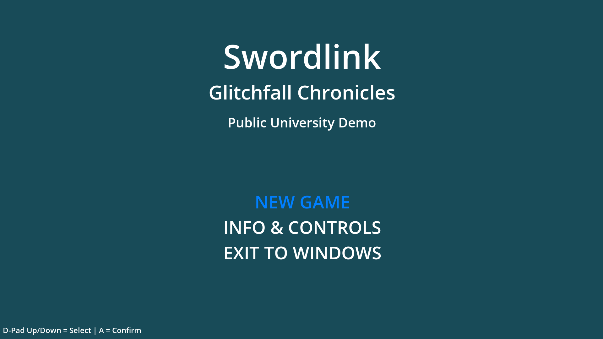
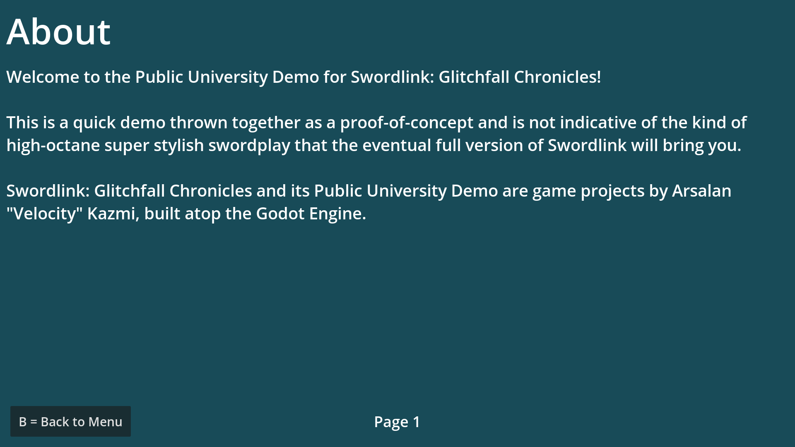
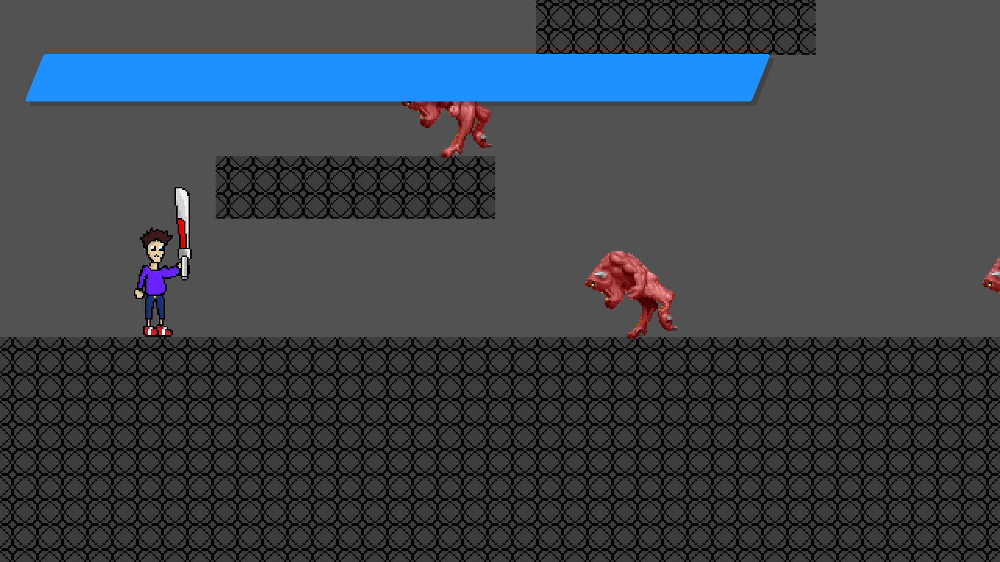

Swordlink: Glitchfall Chronicles Documentation
==============================================

.. warning::
   This documentation and associated documentation files pertain to the Public
   University Demo of Swordlink: Glitchfall Chronicles.  These are subject to
   change at any time without notice.

Overview
------------

Swordlink: Glitchfall Chronicles is a 2D stylish action and puzzle game starring
the brilliant programmer, Joel, on a mission to protect his world from the
digital demons that dare threaten it, with his trusty sword, the Circuit Saber.

Swordlink: Glitchfall Chronicles is built in the Godot Engine, free software
under the GNU General Public License, either version 3 of the license, or, at
your option, any later version.

Public University Demo
----------------------

The Public University Demo of Swordlink: Glitchfall Chronicles focuses mainly
on the gameplay mechanics of Swordlink without so much worrying about graphics
or a story or anything too cohesive that you might see in the full version.

As such, it contains the following copyrighted/trademarked material:

- Sword sound effects from Devil May Cry 3
- Evade sound effect from Sonic the Hedgehog 3
- Menu sound effects from Sonic the Hedgehog (2006)
- Main menu music from Yakuza/Ryu ga Gotoku
- Help menu music from Sonic Adventure 2
- Battle music from Yakuza Kiwami/Ryu ga Gotoku Kiwami
- Enemy sprites from DOOM

These are **placeholders**, and will be replaced with original assets in the
full edition of Swordlink: Glitchfall Chronicles.

The Public University Demo additionally does not include any puzzles, focusing
solely on the combat.

As the Public University Demo includes copyrighted and trademarked material, it
is not legally available to be sold for money, so it's entirely free for
non-commercial use.

Main Menu
---------

Upon starting the game, the main menu is shown.

From here, you can start a new game, read the help menu, or quit the game and
return to your desktop or home menu.

Use **Up** and **Down** to select an option, and press **Enter** (keyboard),
**A** (controller) or **OK** (touchscreen) to activate the selected option.

Help Menu
---------

Choose "INFO & CONTROLS" and you'll be taken to the help menu.

The help menu is split into three pages - **About**, **Basic Controls** and
**Special Attacks**.

Use **Up** and **Down** to flip through the pages.

When you're done reading through the help pages, press **Esc** (keyboard),
**B** (controller) or **BACK** (touchscreen) to return back to the main menu.

Controls
--------

To understand the following, you'll need to read these controls first.

Keyboard Only
^^^^^^^^^^^^^

* **Move** - Left and Right arrow keys
  * **Left** - Left arrow key
  * **Right** - Right arrow key
* **Jump** - Space key
* **Attack** - Z key
* **Special** - X key
* **Evade** - C key or Shift key
* **Mode-Shift** - Ctrl key
* **Menu** - Esc key

Keyboard and Mouse
^^^^^^^^^^^^^^^^^^

* **Move** - A and D keys
  * **Left** - A key
  * **Right** - D key
* **Jump** - Space key
* **Attack** - Left mouse button
* **Special** - Right mouse button
* **Evade** - Shift key
* **Mode-Shift** - Middle mouse button
* **Menu** - Esc key

Controller (Xbox)
^^^^^^^^^^^^^^^^^

* **Move** - Left stick or D-Pad left/right
  * **Left** - Left stick or D-Pad left
  * **Right** - Left stick or D-Pad right
* **Jump** - A button
* **Attack** - Y button 
* **Special** - X button
* **Evade** - B button
* **Mode-Shift** - Right bumper or right trigger
* **Menu** - Start button (called Menu on Xbox One controllers)

Touch
^^^^^

Touch controls are special in that they're represented by rounded squares
with either text or glyphs. So, these will be descriptions based on their
appearances.

* **Move** - Left or right arrows
  * **Left** - Left arrow
  * **Right** - Right arrow
* **Jump** - Up arrow
* **Attack** - Sword tilted 90deg to the right
* **Special** - Sword pointed right with arrows behind it
* **Evade** - Fast-forward icon with a triangular hole in the middle
* **Mode-Shift** - M button
* **Menu** - BACK button

Gameplay
--------

Choose "NEW GAME" to start a new game, jumping straight into the action.

Basics
^^^^^^

That young man holding the sword is Joel, your player character. The large
blue bar is your health bar. Let that deplete and it's game over.

Use the **Left** and **Right** to have Joel move around the level.

Attacking
^^^^^^^^^

When you're up close and personal to the demon heading straight for Joel,
press the **Attack** button to attack. Repeatedly press this button
to perform combos. 

You'll notice a few things will happen on-screen next.

Style Meter
^^^^^^^^^^^

You'll see the amount of damage you dealt to the demon as well as how much
health it has left above its head, but you'll also see a strange white gauge
to the right of your health bar.

That bar is your style meter, and it'll fill up the more hits you manage to dish
out. Getting it high enough will let you net higher and higher ranks, from F to
S. But be careful, because waiting around or getting hit will make it drop.

In addition to raising your style meter, defeating enemies will refill your
health, so be mindful of how much damage you take and how much you dish out,
and the amount of health you regain is dependent on your style rank.

Evasion
^^^^^^^

While you're holding a movement direction, press the **Evade** button to make
Joel perform an evasive dash.

Evading will briefly turn Joel translucent, granting him a small boost of speed
which lets him pass right through enemies - and he can still attack during this
brief invincibility.

Joel can even evade when he's in the middle of being trapped by a bunch of
enemies surrounding him.

Jumping & Aerial Combat
^^^^^^^^^^^^^^^^^^^^^^^

Fighting on the ground is all well and good, but Joel can also take advantage
of his technologically-enhanced jumping shoes to leap high into the air.

Press the **Jump** button to make Joel jump into the air.

.. image:: gameplay-screenshot-5.png

While Joel is in the air, he can still move around and attack just the same.

Influence your mid-air movement with **Left** and **Right** and press the
**Attack** button to perform an aerial attack, which are the same as grounded
attacks.

Performing aerial attacks will cause your style meter to fill up twice as fast,
so prioritise attacking your enemies in the air. But how exactly do you get them
*in* the air...?

Special Attacks
^^^^^^^^^^^^^^^

There are *two* ways to perform special attacks: through the Mode-Shift mechanic
or through Easy Input.

To use Mode-Shift, press and hold the **Mode-Shift** button. Mode-Shift will
lock Joel's orientation and slow down his movement. In Mode-Shift, **Forward**
means "press the direction Joel is facing" and **Back** means "press the
opposite direction".

To use Easy Input, press the **Special** key in combination with a movement
direction.

Stinger
#######

Stinger is a high-damaging, high-knockback thrusting move which throws Joel's
whole weight behind a powerful forward dash with the Circuit Saber. This attack
will damage a high amount of enemies in front of the attack and is effective
at generating style.

To use Stinger in Mode-Shift, hold **Forward** and press **Attack**.

To use Stinger with Easy Input, simply hold either **Left** or **Right** and
press **Special**. Joel will automatically turn around to face the direction you
perform the attack in.

Updraft
#######

Updraft is a low-damage attack which involves Joel swinging the Circuit Saber
upwards, knocking his target upwards. Updraft is mostly designed to set up
aerial attacks, and while it doesn't generate a lot of style on its own, it can
pave the way for a highly stylish aerial combo.

To use Updraft in Mode-Shift, while Joel is on the ground, hold **Back** and
press **Attack**.

To use Updraft with Easy Input, while Joel is on the ground, press the
**Special** button without touching a movement direction.

Hold down **Attack** (Mode-Shift) or **Special** (Easy Input) to let Joel jump
up to the target he just knocked into the air, to set up an easy combo.

Downslash
#########

Downslash can be considered the opposite of Updraft - it's a very high-damaging
attack that not only sends enemies down, but will send Joel plummeting into the
ground after them, whether or not you hold the button.

To use Downslash in Mode-Shift, while Joel is in the air, hold **Back**
and press **Attack**.

To use Downslash with Easy Input, while Joel is in the air, press the
**Special** button without touching a movement direction.

