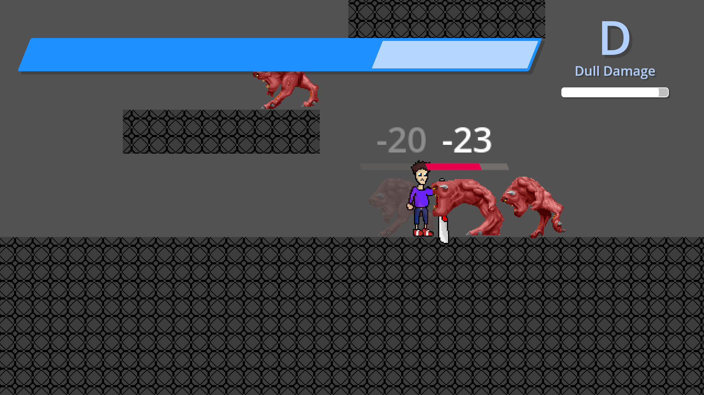

# Swordlink: Glitchfall Chronicles

## Overview

Swordlink: Glitchfall Chronicles is a 2D stylish action and puzzle game where
you play as Joel, a skilled programmer, on a quest to protect his world from
digital demons using his trusty sword, the Circuit Saber.

For in-depth, detailed information on Swordlink: Glitchfall Chronicles, please
see the [official documentation](Docs/docs.rst), affectionately called
"the Docs".

Swordlink: Glitchfall Chronicles is built in the Godot Engine, free software
under the GNU General Public License, either version 3 of the license, or, at
your option, any later version.

## Public University Demo

This version of Swordlink focuses purely on stylish action gameplay mechanics
without finalised graphics, puzzle gameplay or story elements.

It includes placeholder assets from various copyrighted sources, which will be
replaced in the final version. The demo is free for non-commercial use due to
these copyright restrictions.

## Credits

Swordlink: Glitchfall Chronicles is a game by
[Arsalan "Velocity" Kazmi](https://that1m8head.github.io).

The Public University Demo of Swordlink: Glitchfall Chronicles contains
copyrighted material from Devil May Cry 3, Sonic the Hedgehog 3, Sonic the
Hedgehog (2006), Yakuza/Ryu ga Gotoku (and its Kiwami remake), Sonic Adventure
2 and DOOM (1993)/DOOM II: Hell on Earth.

For a full list of this copyrighted material, see the "Public University Demo"
section under the [Docs](Docs/docs.rst#public-university-demo).
